```mermaid
graph LR
    subgraph Traditional["🢠Traditional Application"]
        direction TB
        T1["Fixed Request"] --> T2["Predictable Logic"]
        T2 --> T3["Database Query"]
        T3 --> T4["Format Response"]
        T4 --> T5["Return"]
        
        style T1 fill:#e8e8e8
        style T2 fill:#e8e8e8
        style T3 fill:#e8e8e8
        style T4 fill:#e8e8e8
        style T5 fill:#e8e8e8
    end
    
    subgraph AIAgent["🤖 AI Agent Application"]
        direction TB
        A1["Natural Language"] --> A2{"Interpret Intent"}
        A2 --> A3["Build Context<br/>(RAG + Memory)"]
        A3 --> A4{"LLM Reasoning"}
        A4 -->|"Need data"| A5["Execute Tool"]
        A5 --> A4
        A4 -->|"Need clarification"| A6["Ask User"]
        A6 --> A4
        A4 -->|"Complete"| A7["Synthesize Answer"]
        A7 --> A8["Safety Check"]
        A8 --> A9["Return + Log Trace"]
        
        style A1 fill:#7B68EE,color:#fff
        style A2 fill:#7B68EE,color:#fff
        style A3 fill:#7B68EE,color:#fff
        style A4 fill:#7B68EE,color:#fff
        style A5 fill:#0078D4,color:#fff
        style A6 fill:#0078D4,color:#fff
        style A7 fill:#7B68EE,color:#fff
        style A8 fill:#DC143C,color:#fff
        style A9 fill:#4682B4,color:#fff
    end
    
    Diff["KEY DIFFERENCES:<br/>â”â”â”â”â”â”â”â”â”â”â”â”â”â”<br/>• Non-deterministic path<br/>• Iterative reasoning<br/>• Variable cost/latency<br/>• Tool composition<br/>• Semantic understanding<br/>• Context-aware"]
    
    Traditional -.->|vs| Diff
    AIAgent -.->|vs| Diff
    
    style Diff fill:#fff,stroke:#FF8C00,stroke-width:4px
```

```mermaid
graph TD
    subgraph CostTracking["💰 Cost Tracking & Attribution"]
        direction TB
        
        Request[/"Agent Request"/]
        
        Request --> Meter["Cost Meter<br/>â”â”â”â”â”â”â”â”â”<br/>Track per:<br/>• User<br/>• Agent Type<br/>• Task Category"]
        
        Meter --> InputTokens["Input Tokens<br/>Base: $0.01/1K"]
        Meter --> OutputTokens["Output Tokens<br/>Base: $0.03/1K"]
        Meter --> CachedTokens["Cached Tokens<br/>Discount: 90% off"]
        
        InputTokens --> Accumulate
        OutputTokens --> Accumulate
        CachedTokens --> Accumulate
        
        Accumulate["Accumulate Cost"] --> ToolCosts["+ Tool Execution<br/>• DB queries<br/>• API calls<br/>• Compute time"]
        
        ToolCosts --> TotalCost["Total Request Cost"]
        
        TotalCost --> Budget{"Within Budget?"}
        
        Budget -->|Yes| Log["Log to Cosmos<br/>+ App Insights"]
        Budget -->|No| Alert["🚨 Alert + Throttle"]
        
        Alert --> NotifyOps["Notify Operations"]
        Alert --> CircuitBreaker["Circuit Breaker<br/>Limit iterations"]
        
        Log --> Dashboard["Power BI Dashboard<br/>â”â”â”â”â”â”â”â”â”<br/>• Cost per user<br/>• Cost per agent<br/>• Token efficiency<br/>• Model usage mix"]
        
        Dashboard --> Optimize["Optimization Actions<br/>â”â”â”â”â”â”â”â”â”<br/>• Switch to cheaper models<br/>• Improve prompt caching<br/>• Reduce iterations<br/>• Compress prompts"]
        
        style Request fill:#FF8C00,color:#fff
        style Meter fill:#4682B4,color:#fff
        style InputTokens fill:#2E8B57,color:#fff
        style OutputTokens fill:#2E8B57,color:#fff
        style CachedTokens fill:#2E8B57,color:#fff
        style Budget fill:#DC143C,color:#fff
        style Alert fill:#DC143C,color:#fff
        style Dashboard fill:#4682B4,color:#fff
        style Optimize fill:#7B68EE,color:#fff
    end
    
    Example["Example Calculation:<br/>â”â”â”â”â”â”â”â”â”â”â”â”â”â”<br/>Input: 1,500 tokens × $0.01 = $0.015<br/>Output: 800 tokens × $0.03 = $0.024<br/>Cached: 2,000 tokens × $0.001 = $0.002<br/>Tool: DB query = $0.001<br/>â”â”â”â”â”â”â”â”â”â”â”â”â”â”<br/>Total: $0.042 per request"]
    
    TotalCost -.->|"Real example"| Example
    
    style Example fill:#fff,stroke:#666,stroke-width:2px,stroke-dasharray: 5 5
```

```mermaid
stateDiagram-v2
    [*] --> ReceiveRequest
    
    ReceiveRequest --> ValidateInput: EventBridge trigger
    ValidateInput --> ContentFilter: Schema valid
    ValidateInput --> [*]: Invalid input
    
    ContentFilter --> LoadContext: Guardrails pass
    ContentFilter --> [*]: Harmful content
    
    LoadContext --> CheckCache: DynamoDB + OpenSearch
    
    CheckCache --> CacheHit: Response cached
    CheckCache --> InvokeAgent: Cache miss
    
    CacheHit --> ReturnResponse
    
    state InvokeAgent {
        [*] --> SelectModel
        SelectModel --> InvokeBedrock: Standard query
        SelectModel --> InvokeSageMaker: Custom model
        
        InvokeBedrock --> ParseResponse
        InvokeSageMaker --> ParseResponse
        
        ParseResponse --> ToolCallRequired: Contains tool_use
        ParseResponse --> FinalAnswer: Complete
        
        ToolCallRequired --> ExecuteTool
        ExecuteTool --> ValidateToolResult
        ValidateToolResult --> SelectModel: Add to context
        ValidateToolResult --> HandleError: Tool failed
        
        HandleError --> Retry: Attempt < 3
        HandleError --> FinalAnswer: Max retries
        
        Retry --> ExecuteTool
    }
    
    InvokeAgent --> ValidateOutput
    
    ValidateOutput --> PersistState: Safe output
    ValidateOutput --> [*]: Unsafe output
    
    PersistState --> CacheResponse: DynamoDB write
    CacheResponse --> LogMetrics: ElastiCache set
    LogMetrics --> ReturnResponse: CloudWatch + X-Ray
    
    ReturnResponse --> [*]
    
    note right of InvokeAgent
        Orchestrated by Step Functions:
        - Express workflow (< 5 min)
        - Error retry with backoff
        - Dead letter queue for failures
        - Cost per execution tracked
    end note
    
    note right of LogMetrics
        Metrics logged:
        • Input/output tokens
        • Model invocations
        • Tool executions
        • Total cost (Bedrock + Lambda)
        • Cache hit rate
    end note
```

```mermaid
graph LR
    subgraph Traditional["🏢 Traditional AWS Application"]
        direction TB
        T1["ALB/API Gateway"] --> T2["Lambda/ECS"]
        T2 --> T3["RDS Query"]
        T3 --> T4["Format JSON"]
        T4 --> T5["Return 200 OK"]
        
        T_Compute["Compute:<br/>Fixed Lambda timeout<br/>Predictable memory"]
        T_Data["Data:<br/>Relational schema<br/>SQL queries"]
        T_Cost["Cost:<br/>$0.0001 per request<br/>±10% variance"]
        
        style T1 fill:#e8e8e8
        style T2 fill:#e8e8e8
        style T3 fill:#e8e8e8
        style T4 fill:#e8e8e8
        style T5 fill:#e8e8e8
        style T_Compute fill:#f5f5f5,stroke:#999
        style T_Data fill:#f5f5f5,stroke:#999
        style T_Cost fill:#f5f5f5,stroke:#999
    end
    
    subgraph AIAgent["🤖 AI Agent AWS Application"]
        direction TB
        A1["API Gateway + WAF"] --> A2{"Bedrock Guardrails"}
        A2 --> A3["Load Context<br/>(DynamoDB + OpenSearch)"]
        A3 --> A4{"Bedrock Reasoning"}
        A4 -->|"tool_use"| A5["Lambda Tool Executor"]
        A5 --> A4
        A4 -->|"needs_docs"| A6["Kendra Search"]
        A6 --> A4
        A4 -->|"long_workflow"| A7["Step Functions"]
        A7 --> A4
        A4 -->|"complete"| A8["Synthesize Answer"]
        A8 --> A9["Content Filter + Cache"]
        A9 --> A10["Return + X-Ray trace"]
        
        A_Compute["Compute:<br/>Variable duration (1s - 15m)<br/>GPU instances for inference<br/>Auto-scaling 0→100"]
        A_Data["Data:<br/>Vector embeddings<br/>Semantic search<br/>Graph relationships"]
        A_Cost["Cost:<br/>$0.001 - $0.50 per request<br/>500x variance possible"]
        
        style A1 fill:#FF9900,color:#000
        style A2 fill:#DD344C,color:#fff
        style A3 fill:#3B48CC,color:#fff
        style A4 fill:#8B4789,color:#fff
        style A5 fill:#FF9900,color:#000
        style A6 fill:#8B4789,color:#fff
        style A7 fill:#759C3E,color:#fff
        style A8 fill:#8B4789,color:#fff
        style A9 fill:#3B48CC,color:#fff
        style A10 fill:#146EB4,color:#fff
        style A_Compute fill:#fff7e6,stroke:#FF9900,stroke-width:2px
        style A_Data fill:#fff7e6,stroke:#FF9900,stroke-width:2px
        style A_Cost fill:#fff7e6,stroke:#FF9900,stroke-width:2px
    end
    
    Diff["KEY AWS-SPECIFIC DIFFERENCES:<br/>━━━━━━━━━━━━━━━━━━━<br/>• Bedrock managed models vs self-hosted<br/>• Guardrails for safety vs custom filters<br/>• Step Functions for orchestration<br/>• X-Ray for reasoning trace analysis<br/>• EventBridge for async triggers<br/>• DynamoDB streams for state changes<br/>• Lambda reserved concurrency limits"]
    
    Traditional -.->|vs| Diff
    AIAgent -.->|vs| Diff
    
    style Diff fill:#fff,stroke:#FF9900,stroke-width:4px
```

```mermaid
graph TD
    subgraph CostTracking["💰 AWS AI Agent Cost Tracking"]
        direction TB
        
        Request[/"Agent Request"/]
        
        Request --> Meter["Cost Meter<br/>━━━━━━━━━<br/>CloudWatch Custom Metrics<br/>Track by:<br/>• User ID (tag)<br/>• Agent type (dimension)<br/>• Model used"]
        
        Meter --> BedrockCost["Bedrock Costs<br/>━━━━━━━━━<br/>Input tokens: $0.008/1K<br/>Output tokens: $0.024/1K<br/>(Claude 3 Sonnet)"]
        
        Meter --> LambdaCost["Lambda Costs<br/>━━━━━━━━━<br/>Duration-based<br/>Memory allocation<br/>Invocation count"]
        
        Meter --> DataCost["Data Transfer<br/>━━━━━━━━━<br/>• DynamoDB RCU/WCU<br/>• OpenSearch queries<br/>• S3 GET/PUT<br/>• ElastiCache ops"]
        
        BedrockCost --> Accumulate
        LambdaCost --> Accumulate
        DataCost --> Accumulate
        
        Accumulate["Aggregate Cost"] --> ToolCosts["+ Tool Execution<br/>━━━━━━━━━<br/>• Lambda invocations<br/>• External API calls<br/>• Kendra queries<br/>• SageMaker endpoints"]
        
        ToolCosts --> TotalCost["Total Request Cost<br/>Tagged with:<br/>cost-center, project, user"]
        
        TotalCost --> Budget{"Within Budget?<br/>AWS Budgets check"}
        
        Budget -->|Yes| Log["Log to:<br/>• CloudWatch Logs<br/>• DynamoDB cost table<br/>• S3 (daily aggregates)"]
        Budget -->|No| Alert["🚨 Budget Alert"]
        
        Alert --> SNS["SNS Topic<br/>━━━━━━━━━<br/>• Email ops team<br/>• Slack webhook<br/>• PagerDuty"]
        Alert --> Throttle["API Gateway<br/>Usage Plan throttle<br/>━━━━━━━━━<br/>Reduce rate limits<br/>Return 429"]
        Alert --> CircuitBreaker["Lambda env var:<br/>MAX_ITERATIONS=3<br/>Block expensive ops"]
        
        Log --> CostExplorer["AWS Cost Explorer<br/>━━━━━━━━━<br/>• Daily breakdown<br/>• Service allocation<br/>• Forecast trends"]
        
        Log --> QuickSight["QuickSight Dashboard<br/>━━━━━━━━━<br/>• Cost per user<br/>• Model efficiency<br/>• Token/$ trends<br/>• Agent ROI"]
        
        QuickSight --> Optimize["Optimization Actions<br/>━━━━━━━━━━━━━━<br/>1. Switch to Haiku for simple tasks<br/>2. Enable prompt caching (90% discount)<br/>3. Use reserved concurrency<br/>4. Batch DynamoDB writes<br/>5. Compress prompts<br/>6. ElastiCache aggressive TTL"]
        
        CostExplorer --> Optimize
        
        style Request fill:#FF9900,color:#000
        style Meter fill:#146EB4,color:#fff
        style BedrockCost fill:#8B4789,color:#fff
        style LambdaCost fill:#FF9900,color:#000
        style DataCost fill:#3B48CC,color:#fff
        style Budget fill:#DD344C,color:#fff
        style Alert fill:#DD344C,color:#fff
        style SNS fill:#DD344C,color:#fff
        style QuickSight fill:#146EB4,color:#fff
        style Optimize fill:#759C3E,color:#fff
    end
    
    Example["Real Example Calculation:<br/>━━━━━━━━━━━━━━━━━━<br/>Bedrock (Claude Sonnet):<br/>  Input: 2,000 tokens × $0.008 = $0.016<br/>  Output: 800 tokens × $0.024 = $0.019<br/>Lambda (agent orchestrator):<br/>  2GB × 3s × $0.0000166667 = $0.0001<br/>Lambda (3 tool calls):<br/>  512MB × 0.5s × 3 × $0.0000083334 = $0.00001<br/>DynamoDB:<br/>  2 reads + 1 write = $0.0003<br/>OpenSearch:<br/>  1 query = $0.001<br/>━━━━━━━━━━━━━━━━━━<br/>Total: $0.037 per complex request<br/><br/>Simple cached request: $0.003"]
    
    TotalCost -.->|"Actual AWS bill"| Example
    
    style Example fill:#fff,stroke:#666,stroke-width:2px,stroke-dasharray: 5 5
    
    CachingStrategy["Prompt Caching Strategy:<br/>━━━━━━━━━━━━━━━━━━<br/>System prompts: Cache 5 min<br/>User context: Cache 1 min<br/>RAG results: Cache 30 min<br/>━━━━━━━━━━━━━━━━━━<br/>Savings: 50-70% on repeated queries"]
    
    Optimize -.->|"Implement"| CachingStrategy
    
    style CachingStrategy fill:#e6ffe6,stroke:#759C3E,stroke-width:2px
```

# AI-Agentic-Architecture-Azure

# Main

# RequestRoute

# State

# Comparison

# Cost Breakdown

# AI-Agentic-Architecture-AWS
# Main

# Request Route

# State

# Comparison

# Cost Breakdown

# AI-Agentic Architecture: Handling Ambiguity & Unfavorable Responses

This is one of the most critical architectural differences between traditional systems and AI agents. Let me break this down with diagrams and explanations.

# The Core Difference: Error vs. Clarification Loop

```mermaid
graph TB
    subgraph Traditional["🏢 Traditional Architecture: Binary Error Handling"]
        direction TB
        T_Request["User Request"] --> T_Validate["Validate Input"]
        T_Validate -->|"Valid"| T_Process["Process Logic"]
        T_Validate -->|"Invalid"| T_Error["❌ Return Error<br/>400 Bad Request<br/>422 Validation Failed"]
        T_Process -->|"Success"| T_Success["✅ 200 OK"]
        T_Process -->|"Failure"| T_Error2["❌ 500 Internal Error<br/>404 Not Found"]
        
        T_Error --> T_End["End Session"]
        T_Error2 --> T_End
        T_Success --> T_End
        
        style T_Error fill:#DC143C,color:#fff
        style T_Error2 fill:#DC143C,color:#fff
        style T_End fill:#666,color:#fff
    end
    
    subgraph AIAgent["🤖 AI-Agentic Architecture: Collaborative Clarification"]
        direction TB
        A_Request["User Request<br/>(may be ambiguous)"] --> A_Interpret{"Interpret Intent<br/>Confidence score"}
        
        A_Interpret -->|"High confidence<br/>(>90%)"| A_Execute["Execute Action"]
        A_Interpret -->|"Medium confidence<br/>(60-90%)"| A_Clarify["Generate Clarification<br/>Options"]
        A_Interpret -->|"Low confidence<br/>(<60%)"| A_Clarify
        A_Interpret -->|"Multiple intents"| A_Clarify
        
        A_Clarify --> A_Present["Present Options UI<br/>━━━━━━━━━<br/>🔘 Option A: [interpretation 1]<br/>🔘 Option B: [interpretation 2]<br/>🔘 Option C: [interpretation 3]<br/>✍️ Rephrase my request"]
        
        A_Present --> A_UserChoice["User Selection"]
        A_UserChoice --> A_Execute
        
        A_Execute --> A_Validate{"Result Quality<br/>Assessment"}
        
        A_Validate -->|"Success"| A_Success["✅ Present Result<br/>+ Confidence indicator"]
        A_Validate -->|"Partial success"| A_Refine["Suggest Refinements<br/>━━━━━━━━━<br/>'I found X, did you mean Y?'<br/>'Would you like me to...'"]
        A_Validate -->|"No results"| A_Alternatives["Offer Alternatives<br/>━━━━━━━━━<br/>'No exact match, but...'<br/>'Here are similar options'"]
        A_Validate -->|"Constraint violation"| A_Guardrails["Show Guardrails<br/>━━━━━━━━━<br/>'I can help with A, B, C'<br/>'Let's try a different approach'"]
        
        A_Refine --> A_UserFeedback["User Feedback Loop"]
        A_Alternatives --> A_UserFeedback
        A_Guardrails --> A_UserFeedback
        A_UserFeedback --> A_Execute
        
        A_Success --> A_Continue["Continue Conversation"]
        
        style A_Clarify fill:#FF9900,color:#000
        style A_Present fill:#7B68EE,color:#fff
        style A_Refine fill:#FF9900,color:#000
        style A_Alternatives fill:#FF9900,color:#000
        style A_Guardrails fill:#759C3E,color:#fff
        style A_Success fill:#2E8B57,color:#fff
        style A_Continue fill:#4682B4,color:#fff
    end
    
    Note1["Traditional: Session terminates on error<br/>User must start over"]
    Note2["AI Agent: Conversation continues<br/>System collaborates to clarify"]
    
    Traditional -.->|"Philosophy"| Note1
    AIAgent -.->|"Philosophy"| Note2
    
    style Note1 fill:#ffe6e6,stroke:#DC143C
    style Note2 fill:#e6ffe6,stroke:#2E8B57
```

# Detailed Clarification Loop Architecture

```mermaid
sequenceDiagram
    autonumber
    participant User
    participant API as API Gateway
    participant Agent as Agent Orchestrator
    participant Intent as Intent Classifier
    participant LLM as LLM (Bedrock/OpenAI)
    participant Options as Options Generator
    participant UI as Frontend UI
    participant Tools as Tool Executor
    participant Memory as Conversation Memory
    
    User->>API: "Find claims for John"
    API->>Agent: Process request
    Agent->>Memory: Load context
    Memory-->>Agent: Previous conversation
    
    Agent->>Intent: Classify intent + extract entities
    
    rect rgb(255, 140, 0, 0.1)
        Note over Intent: Ambiguity Detection:<br/>• Multiple "John" matches<br/>• Missing required params<br/>• Unclear timeframe
        Intent-->>Agent: Confidence: 45%<br/>Ambiguity: Multiple entities
    end
    
    alt Confidence < 60%: Clarification Required
        Agent->>LLM: Generate clarification prompt
        LLM-->>Agent: Structured options
        
        Agent->>Options: Format as UI choices
        Options-->>Agent: {<br/>  type: "radio",<br/>  question: "Which John?",<br/>  options: [...]<br/>}
        
        Agent->>UI: Render clarification widget
        UI-->>User: 🤔 "I found 3 Johns:<br/>🔘 John Smith (ID: 12345)<br/>🔘 John Doe (ID: 67890)<br/>🔘 John Williams (ID: 24680)<br/>Or describe more details"
        
        User->>UI: Select "John Smith"
        UI->>Agent: Clarification: patient_id=12345
        
        Agent->>Memory: Store clarification
        Agent->>Intent: Re-classify with clarification
        Intent-->>Agent: Confidence: 95%
    end
    
    Agent->>Tools: Execute query(patient_id=12345)
    Tools-->>Agent: Results: 27 claims
    
    rect rgb(46, 139, 87, 0.1)
        Note over Agent: Success path
    end
    
    Agent->>LLM: Format response
    LLM-->>Agent: Natural language summary
    Agent->>UI: "John Smith has 27 claims..."
    UI-->>User: Display results
    
    alt User wants to refine
        User->>UI: "Show only recent ones"
        UI->>Agent: Refinement request
        Note over Agent: Continue conversation loop
    end
```

# The Unfavorable Response Handler

# Implementation: The Clarification System

```mermaid
graph TB
    subgraph ClarificationEngine["Clarification Engine Architecture"]
        direction TB
        
        Input["User Input<br/>(Potentially ambiguous)"]
        
        Input --> Parser["NLU Parser<br/>━━━━━━━━━<br/>Extract:<br/>• Entities<br/>• Intent<br/>• Parameters<br/>• Context clues"]
        
        Parser --> Analyzer["Ambiguity Analyzer<br/>━━━━━━━━━<br/>Check for:<br/>• Multiple entity matches<br/>• Missing required fields<br/>• Conflicting constraints<br/>• Out-of-bounds requests"]
        
        Analyzer --> Scorer{"Confidence<br/>Scorer"}
        
        Scorer -->|"> 90%"| DirectExecution["Direct Execution<br/>━━━━━━━━━<br/>High confidence<br/>Single clear path"]
        
        Scorer -->|"60-90%"| Strategy1["Disambiguation<br/>Strategy"]
        Scorer -->|"< 60%"| Strategy1
        
        Strategy1 --> MultiMatch{"Issue Type?"}
        
        MultiMatch -->|"Multiple entities"| EntityDisambiguation["Entity Disambiguation<br/>━━━━━━━━━<br/>Query: 'John' → 3 matches<br/>━━━━━━━━━<br/>Options:<br/>🔘 John Smith (Acct: 12345)<br/>🔘 John Doe (Acct: 67890)<br/>🔘 John Williams (Acct: 24680)<br/>━━━━━━━━━<br/>Rank by:<br/>• Recent interactions<br/>• Context similarity<br/>• User history"]
        
        MultiMatch -->|"Missing params"| ParameterElicitation["Parameter Elicitation<br/>━━━━━━━━━<br/>Request: 'Show claims'<br/>━━━━━━━━━<br/>Guided prompts:<br/>📅 Date range?<br/>  🔘 Last 30 days<br/>  🔘 Last 90 days<br/>  🔘 Custom range<br/>👤 Which patient?<br/>  [Search field with autocomplete]<br/>💼 Claim status?<br/>  ☑️ Pending<br/>  ☑️ Approved<br/>  ☐ Denied"]
        
        MultiMatch -->|"Conflicting rules"| ConstraintNegotiation["Constraint Negotiation<br/>━━━━━━━━━<br/>Issue: 'Export 50K records'<br/>Limit: 10K per export<br/>━━━━━━━━━<br/>Options:<br/>🔘 Export first 10K now,<br/>   queue remaining batches<br/>🔘 Apply filters to reduce<br/>   dataset size<br/>🔘 Schedule async export<br/>   (email when ready)<br/>━━━━━━━━━<br/>Explain tradeoffs"]
        
        MultiMatch -->|"Out of scope"| ScopeGuidance["Scope Guidance<br/>━━━━━━━━━<br/>Request: 'Delete all claims'<br/>━━━━━━━━━<br/>Response:<br/>'I can't delete claims, but<br/>I can help you:<br/>🔹 Mark claims as reviewed<br/>🔹 Archive old claims<br/>🔹 Export claims for analysis<br/>🔹 Generate audit reports'<br/>━━━━━━━━━<br/>Redirect to valid paths"]
        
        EntityDisambiguation --> OptionsFormatter
        ParameterElicitation --> OptionsFormatter
        ConstraintNegotiation --> OptionsFormatter
        ScopeGuidance --> OptionsFormatter
        
        OptionsFormatter["Options Formatter<br/>━━━━━━━━━<br/>Generate UI schema:<br/>{<br/>  type: 'radio'|'checkbox'|'input',<br/>  question: string,<br/>  options: [...],<br/>  context: string,<br/>  suggestions: [...]<br/>}"]
        
        OptionsFormatter --> UIRenderer["UI Renderer<br/>━━━━━━━━━<br/>Render as:<br/>• Modal dialog<br/>• Inline form<br/>• Conversational prompts<br/>• Guided wizard"]
        
        UIRenderer --> UserFeedback["User Provides<br/>Clarification"]
        
        UserFeedback --> ContextUpdater["Context Updater<br/>━━━━━━━━━<br/>Merge clarification:<br/>• Update parameters<br/>• Add to conversation memory<br/>• Learn preferences<br/>• Update confidence score"]
        
        ContextUpdater --> Reprocess["Re-process Request<br/>with enriched context"]
        
        Reprocess --> Analyzer
        
        DirectExecution --> ResultValidator["Result Validator<br/>━━━━━━━━━<br/>Assess quality:<br/>• Data completeness<br/>• Relevance score<br/>• Constraint satisfaction"]
        
        ResultValidator --> QualityCheck{"Quality<br/>Check"}
        
        QualityCheck -->|"High quality"| Success["✅ Present Result<br/>+ Confidence badge<br/>+ Follow-up suggestions"]
        
        QualityCheck -->|"Acceptable"| Refinement["Offer Refinement<br/>━━━━━━━━━<br/>'Found 127 claims.<br/>Would you like to:<br/>🔹 Filter by status<br/>🔹 Sort by date<br/>🔹 Export subset<br/>🔹 View summary stats'"]
        
        QualityCheck -->|"Poor/Empty"| Alternatives["Suggest Alternatives<br/>━━━━━━━━━<br/>'No claims found for<br/>John Smith in Q4 2024.<br/><br/>Options:<br/>🔹 Expand to full year 2024<br/>🔹 Check similar names<br/>🔹 Search by claim ID<br/>🔹 Review recent activity'"]
        
        Refinement --> UserAction["User Takes Action"]
        Alternatives --> UserAction
        UserAction --> Analyzer
        
        Success --> Memory["Update Memory<br/>━━━━━━━━━<br/>Store:<br/>• Successful pattern<br/>• User preferences<br/>• Common disambiguations<br/>• Refinement history"]
        
        Memory --> ContinueConversation["Continue<br/>Conversation"]
        
        style Input fill:#FF9900,color:#000
        style Analyzer fill:#8B4789,color:#fff
        style Scorer fill:#8B4789,color:#fff
        style EntityDisambiguation fill:#7B68EE,color:#fff
        style ParameterElicitation fill:#7B68EE,color:#fff
        style ConstraintNegotiation fill:#FF8C00,color:#fff
        style ScopeGuidance fill:#759C3E,color:#fff
        style UIRenderer fill:#4682B4,color:#fff
        style Success fill:#2E8B57,color:#fff
        style Refinement fill:#FF9900,color:#000
        style Alternatives fill:#FF9900,color:#000
        style Memory fill:#3B48CC,color:#fff
    end
    
    LearningLoop["Machine Learning Loop<br/>━━━━━━━━━━━━━━<br/>Continuously improve:<br/>• Disambiguation accuracy<br/>• Option ranking<br/>• Preference prediction<br/>• Context understanding"]
    
    Memory -.->|"Train models"| LearningLoop
    LearningLoop -.->|"Update"| Analyzer
    
    style LearningLoop fill:#fff9e6,stroke:#FF9900,stroke-width:3px
```

# Code Example: Clarification Handler (AWS Lambda)

Here's how this would be implemented in code:
```python
# clarification_handler.py
from typing import Dict, List, Optional
from enum import Enum
from dataclasses import dataclass

class ConfidenceLevel(Enum):
    HIGH = "high"      # > 90%
    MEDIUM = "medium"  # 60-90%
    LOW = "low"        # < 60%

class ClarificationType(Enum):
    ENTITY_DISAMBIGUATION = "entity_disambiguation"
    PARAMETER_ELICITATION = "parameter_elicitation"
    CONSTRAINT_NEGOTIATION = "constraint_negotiation"
    SCOPE_GUIDANCE = "scope_guidance"

@dataclass
class ClarificationRequest:
    type: ClarificationType
    question: str
    options: List[Dict]
    context: str
    ui_type: str  # "radio", "checkbox", "input", "guided_wizard"
    
@dataclass
class IntentAnalysisResult:
    confidence: float
    intent: str
    entities: Dict
    ambiguities: List[str]
    missing_params: List[str]

class ClarificationEngine:
    def __init__(self, bedrock_client, dynamodb_table):
        self.bedrock = bedrock_client
        self.memory = dynamodb_table
        
    async def analyze_intent(self, user_input: str, context: Dict) -> IntentAnalysisResult:
        """Analyze user input and detect ambiguities"""
        
        # Use LLM to extract intent and entities
        prompt = f"""Analyze this request and extract:
        1. Primary intent
        2. Entities mentioned
        3. Any ambiguities or missing information
        4. Confidence score (0-100)
        
        User request: "{user_input}"
        Context: {context}
        
        Respond in JSON format."""
        
        response = await self.bedrock.invoke_model(
            modelId="anthropic.claude-3-sonnet",
            body={"prompt": prompt, "temperature": 0}
        )
        
        analysis = self._parse_llm_response(response)
        
        # Check for entity matches in database
        if 'patient_name' in analysis['entities']:
            matches = await self._find_entity_matches(
                analysis['entities']['patient_name']
            )
            if len(matches) > 1:
                analysis['ambiguities'].append(f"Multiple patients named {analysis['entities']['patient_name']}")
        
        return IntentAnalysisResult(**analysis)
    
    async def generate_clarification(
        self, 
        analysis: IntentAnalysisResult
    ) -> ClarificationRequest:
        """Generate clarification UI based on ambiguity type"""
        
        # Entity disambiguation
        if "Multiple patients" in str(analysis.ambiguities):
            patient_name = analysis.entities.get('patient_name')
            matches = await self._find_entity_matches(patient_name)
            
            options = [
                {
                    "id": match['patient_id'],
                    "label": f"{match['full_name']} (ID: {match['patient_id']})",
                    "metadata": {
                        "last_visit": match['last_visit_date'],
                        "relevance_score": match['score']
                    }
                }
                for match in matches
            ]
            
            # Sort by relevance (recent interactions, context similarity)
            options = self._rank_options(options, analysis.context)
            
            return ClarificationRequest(
                type=ClarificationType.ENTITY_DISAMBIGUATION,
                question=f"I found {len(matches)} patients named {patient_name}. Which one?",
                options=options,
                context=f"Based on your recent activity, {options[0]['label']} seems most likely.",
                ui_type="radio"
            )
        
        # Missing parameters
        if analysis.missing_params:
            return self._generate_parameter_form(analysis)
        
        # Constraint violation
        if self._check_constraint_violation(analysis):
            return self._generate_constraint_negotiation(analysis)
        
        # Out of scope
        if analysis.confidence < 0.4:
            return self._generate_scope_guidance(analysis)
    
    def _generate_parameter_form(self, analysis: IntentAnalysisResult) -> ClarificationRequest:
        """Generate multi-field form for missing parameters"""
        
        options = []
        
        if 'date_range' in analysis.missing_params:
            options.append({
                "field": "date_range",
                "type": "radio",
                "label": "Date range",
                "choices": [
                    {"value": "30d", "label": "Last 30 days", "default": True},
                    {"value": "90d", "label": "Last 90 days"},
                    {"value": "custom", "label": "Custom range"}
                ]
            })
        
        if 'claim_status' in analysis.missing_params:
            options.append({
                "field": "claim_status",
                "type": "checkbox",
                "label": "Claim status",
                "choices": [
                    {"value": "pending", "label": "Pending", "checked": True},
                    {"value": "approved", "label": "Approved", "checked": True},
                    {"value": "denied", "label": "Denied", "checked": False}
                ]
            })
        
        return ClarificationRequest(
            type=ClarificationType.PARAMETER_ELICITATION,
            question="I need a few more details to find the right claims:",
            options=options,
            context="Based on typical queries, I've pre-selected common options.",
            ui_type="form"
        )
    
    def _generate_constraint_negotiation(self, analysis: IntentAnalysisResult) -> ClarificationRequest:
        """Handle requests that violate business rules"""
        
        # Example: User wants to export 50K records, but limit is 10K
        requested_count = analysis.entities.get('record_count', 0)
        max_allowed = 10000
        
        if requested_count > max_allowed:
            options = [
                {
                    "id": "batch_export",
                    "label": f"Export first {max_allowed} now, queue remaining {requested_count - max_allowed} in batches",
                    "pros": "Get partial data immediately",
                    "cons": "Multiple files to manage"
                },
                {
                    "id": "apply_filters",
                    "label": "Apply filters to reduce dataset size",
                    "pros": "Single file, faster",
                    "cons": "May need to refine criteria"
                },
                {
                    "id": "async_export",
                    "label": "Schedule full async export (email when ready)",
                    "pros": "Get all data in one file",
                    "cons": "Wait 15-30 minutes"
                }
            ]
            
            return ClarificationRequest(
                type=ClarificationType.CONSTRAINT_NEGOTIATION,
                question=f"I can't export {requested_count} records at once (limit: {max_allowed}). Let's find a solution:",
                options=options,
                context="Our system limits exports to maintain performance for all users.",
                ui_type="radio_with_details"
            )
    
    def _generate_scope_guidance(self, analysis: IntentAnalysisResult) -> ClarificationRequest:
        """Redirect out-of-scope requests to valid capabilities"""
        
        # Use LLM to suggest alternative actions
        prompt = f"""The user requested: "{analysis.intent}"
        
        This is outside my capabilities. Suggest 3-4 alternative actions I CAN do that might help them achieve a similar goal.
        
        My capabilities include:
        - Search and filter claims
        - Generate reports
        - Export data
        - Mark claims for review
        - View patient history
        
        Respond in JSON format with helpful alternatives."""
        
        response = await self.bedrock.invoke_model(
            modelId="anthropic.claude-3-sonnet",
            body={"prompt": prompt}
        )
        
        alternatives = self._parse_llm_response(response)
        
        return ClarificationRequest(
            type=ClarificationType.SCOPE_GUIDANCE,
            question="I can't do that directly, but I can help you with:",
            options=alternatives['alternatives'],
            context="Let me know which of these would be most helpful, or rephrase your request.",
            ui_type="action_list"
        )
    
    async def process_user_response(
        self,
        original_request: str,
        clarification: ClarificationRequest,
        user_selection: Dict
    ) -> IntentAnalysisResult:
        """Update context with user's clarification and re-process"""
        
        # Merge clarification into context
        enriched_context = {
            **self._get_conversation_context(),
            'clarification_type': clarification.type.value,
            'user_selection': user_selection,
            'original_request': original_request
        }
        
        # Store preference for future use
        await self._store_preference(user_selection)
        
        # Re-analyze with enriched context
        return await self.analyze_intent(original_request, enriched_context)

# Lambda handler
async def lambda_handler(event, context):
    engine = ClarificationEngine(bedrock_client, dynamodb_table)
    
    user_input = event['body']['message']
    conversation_id = event['body']['conversation_id']
    
    # Load conversation context
    conv_context = await load_conversation(conversation_id)
    
    # Analyze intent
    analysis = await engine.analyze_intent(user_input, conv_context)
    
    # Determine response path
    if analysis.confidence > 0.9:
        # High confidence - execute directly
        result = await execute_action(analysis)
        return {
            'statusCode': 200,
            'body': {
                'type': 'result',
                'data': result,
                'confidence': analysis.confidence
            }
        }
    else:
        # Low/medium confidence - request clarification
        clarification = await engine.generate_clarification(analysis)
        return {
            'statusCode': 200,
            'body': {
                'type': 'clarification_needed',
                'clarification': clarification.__dict__,
                'original_analysis': analysis.__dict__
            }
        }
```
# Frontend UI Component Example
```python
// ClarificationWidget.tsx
import React, { useState } from 'react';

interface ClarificationProps {
  type: 'radio' | 'checkbox' | 'form' | 'guided_wizard';
  question: string;
  options: Array<{
    id: string;
    label: string;
    metadata?: any;
  }>;
  context?: string;
  onSelect: (selection: any) => void;
}

export const ClarificationWidget: React.FC<ClarificationProps> = ({
  type,
  question,
  options,
  context,
  onSelect
}) => {
  const [selected, setSelected] = useState<string | string[]>(
    type === 'checkbox' ? [] : ''
  );

  const handleSubmit = () => {
    onSelect({
      type,
      selection: selected,
      timestamp: new Date().toISOString()
    });
  };

  return (
    <div className="clarification-widget">
      <div className="question-header">
        <span className="icon">🤔</span>
        <h3>{question}</h3>
      </div>
      
      {context && (
        <div className="context-hint">
          <span className="icon">💡</span>
          {context}
        </div>
      )}
      
      <div className="options-container">
        {type === 'radio' && options.map(option => (
          <label key={option.id} className="option-radio">
            <input
              type="radio"
              name="clarification"
              value={option.id}
              checked={selected === option.id}
              onChange={(e) => setSelected(e.target.value)}
            />
            <span className="option-label">{option.label}</span>
            {option.metadata && (
              <span className="option-metadata">
                Last visit: {option.metadata.last_visit}
              </span>
            )}
          </label>
        ))}
        
        {type === 'checkbox' && options.map(option => (
          <label key={option.id} className="option-checkbox">
            <input
              type="checkbox"
              value={option.id}
              checked={(selected as string[]).includes(option.id)}
              onChange={(e) => {
                const current = selected as string[];
                setSelected(
                  e.target.checked
                    ? [...current, option.id]
                    : current.filter(id => id !== option.id)
                );
              }}
            />
            <span className="option-label">{option.label}</span>
          </label>
        ))}
      </div>
      
      <div className="action-buttons">
        <button 
          className="btn-primary" 
          onClick={handleSubmit}
          disabled={!selected || (Array.isArray(selected) && selected.length === 0)}
        >
          Continue
        </button>
        <button className="btn-secondary">
          Rephrase my request
        </button>
      </div>
    </div>
  );
};
```
Key Architectural Requirements
1. State Management

Store conversation history with branching paths
Track clarification rounds and user preferences
Enable rollback to previous decision points

2. UI Components

Reusable clarification widgets
Inline vs. modal presentation
Progressive disclosure for complex forms

3. Backend Services

Intent classification service
Entity disambiguation service
Constraint validation engine
Alternative suggestion generator

4. Data Requirements
```python
# DynamoDB Schema for Conversation State
{
    "conversation_id": "conv_123",
    "user_id": "user_456",
    "state": "awaiting_clarification",
    "turns": [
        {
            "turn_id": 1,
            "user_input": "Find claims for John",
            "analysis": {
                "confidence": 0.45,
                "ambiguities": ["Multiple entity matches"]
            },
            "clarification_presented": {
                "type": "entity_disambiguation",
                "options": [...]
            }
        },
        {
            "turn_id": 2,
            "user_selection": {"patient_id": "12345"},
            "enriched_context": {...},
            "confidence": 0.95
        }
    ],
    "preferences_learned": {
        "typical_date_range": "30d",
        "frequent_entities": ["patient_12345", "patient_67890"]
    }
}
```
5. Observability
Track metrics like:

Clarification rate (% of requests needing clarification)
Average rounds to resolution
User satisfaction with clarifications
Preference learning accuracy

This approach transforms errors into conversations and failures into collaborative problem-solving, which is the fundamental shift AI-agentic architecture brings.
