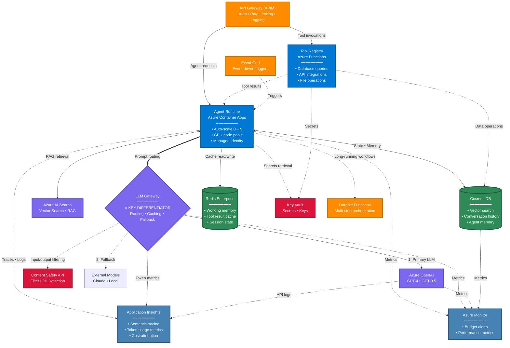
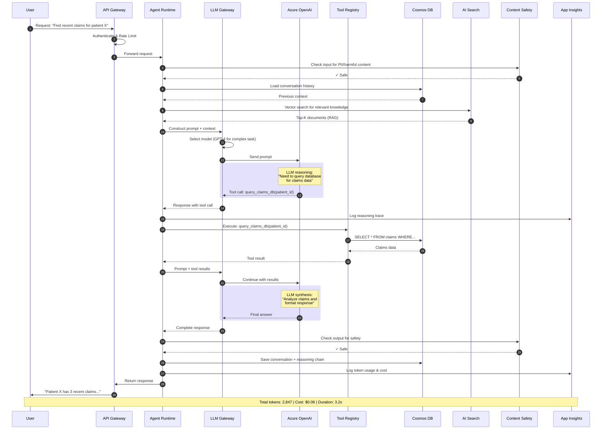
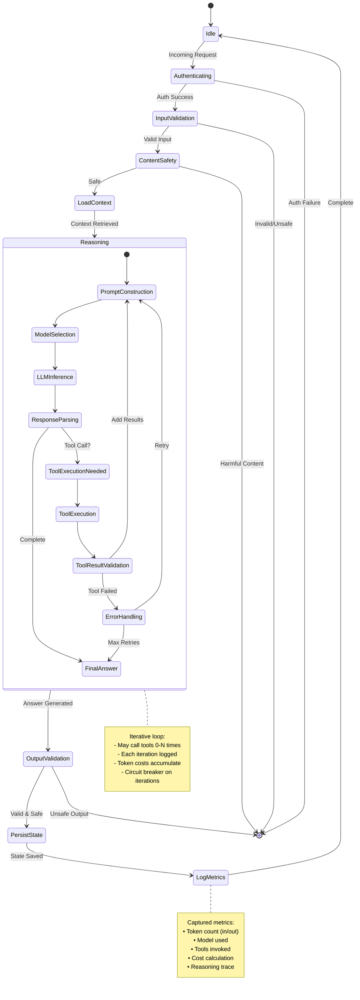
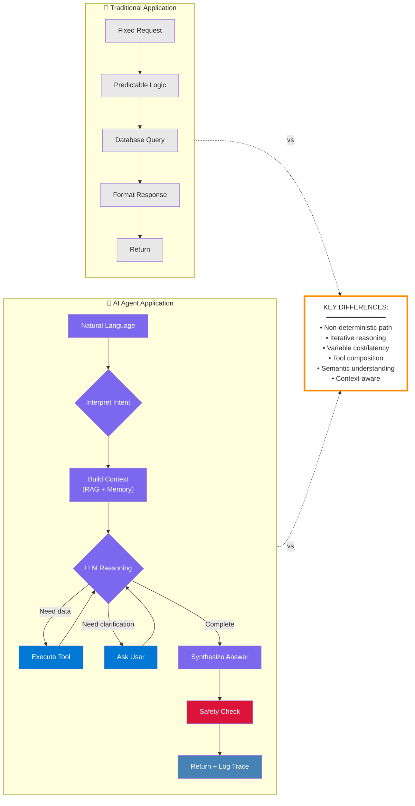
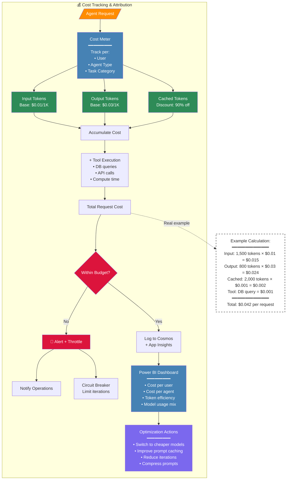

# AI-Agentic-Architecture

# Main

```mermaid
graph TB
    %% Styling
    classDef azure fill:#0078D4,stroke:#005A9E,stroke-width:3px,color:#fff
    classDef aiml fill:#7B68EE,stroke:#5a4db8,stroke-width:3px,color:#fff
    classDef data fill:#2E8B57,stroke:#1e5a3a,stroke-width:3px,color:#fff
    classDef security fill:#DC143C,stroke:#a00f2b,stroke-width:3px,color:#fff
    classDef integration fill:#FF8C00,stroke:#cc7000,stroke-width:3px,color:#fff
    classDef observability fill:#4682B4,stroke:#335f85,stroke-width:3px,color:#fff
    
    %% Entry Layer
    APIM["API Gateway (APIM)<br/>Auth • Rate Limiting • Logging"]
    
    %% Orchestration Layer
    AgentRuntime["Agent Runtime<br/>Azure Container Apps<br/>━━━━━━━━━<br/>• Auto-scale 0→N<br/>• GPU node pools<br/>• Managed Identity"]
    LLMGateway{"LLM Gateway<br/>━━━━━━━━━<br/>⭐ KEY DIFFERENTIATOR<br/>Routing • Caching • Fallback"}
    ToolRegistry["Tool Registry<br/>Azure Functions<br/>━━━━━━━━━<br/>• Database queries<br/>• API integrations<br/>• File operations"]
    
    %% AI/ML Services
    OpenAI["Azure OpenAI<br/>GPT-4 • GPT-3.5"]
    AISearch["Azure AI Search<br/>Vector Search • RAG"]
    ContentSafety["Content Safety API<br/>Filter • PII Detection"]
    
    %% Data Layer
    CosmosDB[("Cosmos DB<br/>━━━━━━━━━<br/>• Vector search<br/>• Conversation history<br/>• Agent memory")]
    Redis[("Redis Enterprise<br/>━━━━━━━━━<br/>• Working memory<br/>• Tool result cache<br/>• Session state")]
    
    %% Security
    KeyVault["Key Vault<br/>Secrets • Keys"]
    
    %% Integration Services
    DurableFuncs["Durable Functions<br/>Multi-step orchestration"]
    EventGrid["Event Grid<br/>Event-driven triggers"]
    
    %% Observability
    AppInsights["Application Insights<br/>━━━━━━━━━<br/>• Semantic tracing<br/>• Token usage metrics<br/>• Cost attribution"]
    Monitor["Azure Monitor<br/>━━━━━━━━━<br/>• Budget alerts<br/>• Performance metrics"]
    
    %% Primary Flows
    APIM -->|"Agent requests"| AgentRuntime
    APIM -->|"Tool invocations"| ToolRegistry
    AgentRuntime ==>|"Prompt routing"| LLMGateway
    LLMGateway -->|"1. Primary LLM"| OpenAI
    LLMGateway -.->|"2. Fallback"| ExternalModels["External Models<br/>Claude • Local"]
    AgentRuntime <-->|"State • Memory"| CosmosDB
    AgentRuntime <-->|"RAG retrieval"| AISearch
    AgentRuntime -->|"Cache read/write"| Redis
    ToolRegistry -.->|"Data operations"| CosmosDB
    ToolRegistry -.->|"Tool results"| AgentRuntime
    
    %% Security Flows
    AgentRuntime -.->|"Secrets retrieval"| KeyVault
    LLMGateway -.->|"Input/output filtering"| ContentSafety
    ToolRegistry -.->|"Secrets"| KeyVault
    
    %% Integration Flows
    EventGrid -.->|"Triggers"| AgentRuntime
    AgentRuntime -.->|"Long-running workflows"| DurableFuncs
    
    %% Observability Flows
    AgentRuntime -.->|"Traces • Logs"| AppInsights
    LLMGateway -.->|"Token metrics"| AppInsights
    OpenAI -.->|"API logs"| AppInsights
    AgentRuntime -.->|"Metrics"| Monitor
    LLMGateway -.->|"Metrics"| Monitor
    OpenAI -.->|"Metrics"| Monitor
    CosmosDB -.->|"Metrics"| Monitor
    
    %% Apply Styles
    class APIM integration
    class AgentRuntime,ToolRegistry azure
    class LLMGateway,OpenAI,AISearch aiml
    class CosmosDB,Redis data
    class KeyVault,ContentSafety security
    class DurableFuncs,EventGrid integration
    class AppInsights,Monitor observability
```
# RequestRoute

```mermaid
sequenceDiagram
    autonumber
    participant User
    participant APIM as API Gateway
    participant Agent as Agent Runtime
    participant Gateway as LLM Gateway
    participant OpenAI as Azure OpenAI
    participant Tools as Tool Registry
    participant Cosmos as Cosmos DB
    participant Search as AI Search
    participant Safety as Content Safety
    participant Insights as App Insights
    
    User->>APIM: Request: "Find recent claims for patient X"
    APIM->>APIM: Authenticate & Rate Limit
    APIM->>Agent: Forward request
    
    Agent->>Safety: Check input for PII/harmful content
    Safety-->>Agent: ✓ Safe
    
    Agent->>Cosmos: Load conversation history
    Cosmos-->>Agent: Previous context
    
    Agent->>Search: Vector search for relevant knowledge
    Search-->>Agent: Top-K documents (RAG)
    
    Agent->>Gateway: Construct prompt + context
    Gateway->>Gateway: Select model (GPT-4 for complex task)
    Gateway->>OpenAI: Send prompt
    
    rect rgb(123, 104, 238, 0.2)
        Note over OpenAI: LLM reasoning:<br/>"Need to query database<br/>for claims data"
        OpenAI-->>Gateway: Tool call: query_claims_db(patient_id)
    end
    
    Gateway-->>Agent: Response with tool call
    Agent->>Insights: Log reasoning trace
    Agent->>Tools: Execute: query_claims_db(patient_id)
    Tools->>Cosmos: SELECT * FROM claims WHERE...
    Cosmos-->>Tools: Claims data
    Tools-->>Agent: Tool result
    
    Agent->>Gateway: Prompt + tool results
    Gateway->>OpenAI: Continue with results
    
    rect rgb(123, 104, 238, 0.2)
        Note over OpenAI: LLM synthesis:<br/>"Analyze claims and<br/>format response"
        OpenAI-->>Gateway: Final answer
    end
    
    Gateway-->>Agent: Complete response
    Agent->>Safety: Check output for safety
    Safety-->>Agent: ✓ Safe
    
    Agent->>Cosmos: Save conversation + reasoning chain
    Agent->>Insights: Log token usage & cost
    Agent->>APIM: Return response
    APIM->>User: "Patient X has 3 recent claims..."
    
    Note over User,Insights: Total tokens: 2,847 | Cost: $0.08 | Duration: 3.2s
```
# State

```mermaid
stateDiagram-v2
    [*] --> Idle
    
    Idle --> Authenticating: Incoming Request
    Authenticating --> InputValidation: Auth Success
    Authenticating --> [*]: Auth Failure
    
    InputValidation --> ContentSafety: Valid Input
    InputValidation --> [*]: Invalid/Unsafe
    
    ContentSafety --> LoadContext: Safe
    ContentSafety --> [*]: Harmful Content
    
    LoadContext --> Reasoning: Context Retrieved
    
    state Reasoning {
        [*] --> PromptConstruction
        PromptConstruction --> ModelSelection
        ModelSelection --> LLMInference
        LLMInference --> ResponseParsing
        ResponseParsing --> ToolExecutionNeeded: Tool Call?
        ResponseParsing --> FinalAnswer: Complete
        
        ToolExecutionNeeded --> ToolExecution
        ToolExecution --> ToolResultValidation
        ToolResultValidation --> PromptConstruction: Add Results
        ToolResultValidation --> ErrorHandling: Tool Failed
        
        ErrorHandling --> PromptConstruction: Retry
        ErrorHandling --> FinalAnswer: Max Retries
    }
    
    Reasoning --> OutputValidation: Answer Generated
    
    OutputValidation --> PersistState: Valid & Safe
    OutputValidation --> [*]: Unsafe Output
    
    PersistState --> LogMetrics: State Saved
    LogMetrics --> Idle: Complete
    
    note right of Reasoning
        Iterative loop:
        - May call tools 0-N times
        - Each iteration logged
        - Token costs accumulate
        - Circuit breaker on iterations
    end note
    
    note right of LogMetrics
        Captured metrics:
        • Token count (in/out)
        • Model used
        • Tools invoked
        • Cost calculation
        • Reasoning trace
    end note
```
# Comparison

```mermaid
graph LR
    subgraph Traditional["🏢 Traditional Application"]
        direction TB
        T1["Fixed Request"] --> T2["Predictable Logic"]
        T2 --> T3["Database Query"]
        T3 --> T4["Format Response"]
        T4 --> T5["Return"]
        
        style T1 fill:#e8e8e8
        style T2 fill:#e8e8e8
        style T3 fill:#e8e8e8
        style T4 fill:#e8e8e8
        style T5 fill:#e8e8e8
    end
    
    subgraph AIAgent["🤖 AI Agent Application"]
        direction TB
        A1["Natural Language"] --> A2{"Interpret Intent"}
        A2 --> A3["Build Context<br/>(RAG + Memory)"]
        A3 --> A4{"LLM Reasoning"}
        A4 -->|"Need data"| A5["Execute Tool"]
        A5 --> A4
        A4 -->|"Need clarification"| A6["Ask User"]
        A6 --> A4
        A4 -->|"Complete"| A7["Synthesize Answer"]
        A7 --> A8["Safety Check"]
        A8 --> A9["Return + Log Trace"]
        
        style A1 fill:#7B68EE,color:#fff
        style A2 fill:#7B68EE,color:#fff
        style A3 fill:#7B68EE,color:#fff
        style A4 fill:#7B68EE,color:#fff
        style A5 fill:#0078D4,color:#fff
        style A6 fill:#0078D4,color:#fff
        style A7 fill:#7B68EE,color:#fff
        style A8 fill:#DC143C,color:#fff
        style A9 fill:#4682B4,color:#fff
    end
    
    Diff["KEY DIFFERENCES:<br/>━━━━━━━━━━━━━━<br/>• Non-deterministic path<br/>• Iterative reasoning<br/>• Variable cost/latency<br/>• Tool composition<br/>• Semantic understanding<br/>• Context-aware"]
    
    Traditional -.->|vs| Diff
    AIAgent -.->|vs| Diff
    
    style Diff fill:#fff,stroke:#FF8C00,stroke-width:4px
```
# Cost Breakdown

```mermaid
graph TD
    subgraph CostTracking["💰 Cost Tracking & Attribution"]
        direction TB
        
        Request[/"Agent Request"/]
        
        Request --> Meter["Cost Meter<br/>━━━━━━━━━<br/>Track per:<br/>• User<br/>• Agent Type<br/>• Task Category"]
        
        Meter --> InputTokens["Input Tokens<br/>Base: $0.01/1K"]
        Meter --> OutputTokens["Output Tokens<br/>Base: $0.03/1K"]
        Meter --> CachedTokens["Cached Tokens<br/>Discount: 90% off"]
        
        InputTokens --> Accumulate
        OutputTokens --> Accumulate
        CachedTokens --> Accumulate
        
        Accumulate["Accumulate Cost"] --> ToolCosts["+ Tool Execution<br/>• DB queries<br/>• API calls<br/>• Compute time"]
        
        ToolCosts --> TotalCost["Total Request Cost"]
        
        TotalCost --> Budget{"Within Budget?"}
        
        Budget -->|Yes| Log["Log to Cosmos<br/>+ App Insights"]
        Budget -->|No| Alert["🚨 Alert + Throttle"]
        
        Alert --> NotifyOps["Notify Operations"]
        Alert --> CircuitBreaker["Circuit Breaker<br/>Limit iterations"]
        
        Log --> Dashboard["Power BI Dashboard<br/>━━━━━━━━━<br/>• Cost per user<br/>• Cost per agent<br/>• Token efficiency<br/>• Model usage mix"]
        
        Dashboard --> Optimize["Optimization Actions<br/>━━━━━━━━━<br/>• Switch to cheaper models<br/>• Improve prompt caching<br/>• Reduce iterations<br/>• Compress prompts"]
        
        style Request fill:#FF8C00,color:#fff
        style Meter fill:#4682B4,color:#fff
        style InputTokens fill:#2E8B57,color:#fff
        style OutputTokens fill:#2E8B57,color:#fff
        style CachedTokens fill:#2E8B57,color:#fff
        style Budget fill:#DC143C,color:#fff
        style Alert fill:#DC143C,color:#fff
        style Dashboard fill:#4682B4,color:#fff
        style Optimize fill:#7B68EE,color:#fff
    end
    
    Example["Example Calculation:<br/>━━━━━━━━━━━━━━<br/>Input: 1,500 tokens × $0.01 = $0.015<br/>Output: 800 tokens × $0.03 = $0.024<br/>Cached: 2,000 tokens × $0.001 = $0.002<br/>Tool: DB query = $0.001<br/>━━━━━━━━━━━━━━<br/>Total: $0.042 per request"]
    
    TotalCost -.->|"Real example"| Example
    
    style Example fill:#fff,stroke:#666,stroke-width:2px,stroke-dasharray: 5 5
```
