```mermaid
graph LR
    subgraph Traditional["🢠Traditional Application"]
        direction TB
        T1["Fixed Request"] --> T2["Predictable Logic"]
        T2 --> T3["Database Query"]
        T3 --> T4["Format Response"]
        T4 --> T5["Return"]
        
        style T1 fill:#e8e8e8
        style T2 fill:#e8e8e8
        style T3 fill:#e8e8e8
        style T4 fill:#e8e8e8
        style T5 fill:#e8e8e8
    end
    
    subgraph AIAgent["🤖 AI Agent Application"]
        direction TB
        A1["Natural Language"] --> A2{"Interpret Intent"}
        A2 --> A3["Build Context<br/>(RAG + Memory)"]
        A3 --> A4{"LLM Reasoning"}
        A4 -->|"Need data"| A5["Execute Tool"]
        A5 --> A4
        A4 -->|"Need clarification"| A6["Ask User"]
        A6 --> A4
        A4 -->|"Complete"| A7["Synthesize Answer"]
        A7 --> A8["Safety Check"]
        A8 --> A9["Return + Log Trace"]
        
        style A1 fill:#7B68EE,color:#fff
        style A2 fill:#7B68EE,color:#fff
        style A3 fill:#7B68EE,color:#fff
        style A4 fill:#7B68EE,color:#fff
        style A5 fill:#0078D4,color:#fff
        style A6 fill:#0078D4,color:#fff
        style A7 fill:#7B68EE,color:#fff
        style A8 fill:#DC143C,color:#fff
        style A9 fill:#4682B4,color:#fff
    end
    
    Diff["KEY DIFFERENCES:<br/>â”â”â”â”â”â”â”â”â”â”â”â”â”â”<br/>• Non-deterministic path<br/>• Iterative reasoning<br/>• Variable cost/latency<br/>• Tool composition<br/>• Semantic understanding<br/>• Context-aware"]
    
    Traditional -.->|vs| Diff
    AIAgent -.->|vs| Diff
    
    style Diff fill:#fff,stroke:#FF8C00,stroke-width:4px
```

```mermaid
graph TD
    subgraph CostTracking["💰 Cost Tracking & Attribution"]
        direction TB
        
        Request[/"Agent Request"/]
        
        Request --> Meter["Cost Meter<br/>â”â”â”â”â”â”â”â”â”<br/>Track per:<br/>• User<br/>• Agent Type<br/>• Task Category"]
        
        Meter --> InputTokens["Input Tokens<br/>Base: $0.01/1K"]
        Meter --> OutputTokens["Output Tokens<br/>Base: $0.03/1K"]
        Meter --> CachedTokens["Cached Tokens<br/>Discount: 90% off"]
        
        InputTokens --> Accumulate
        OutputTokens --> Accumulate
        CachedTokens --> Accumulate
        
        Accumulate["Accumulate Cost"] --> ToolCosts["+ Tool Execution<br/>• DB queries<br/>• API calls<br/>• Compute time"]
        
        ToolCosts --> TotalCost["Total Request Cost"]
        
        TotalCost --> Budget{"Within Budget?"}
        
        Budget -->|Yes| Log["Log to Cosmos<br/>+ App Insights"]
        Budget -->|No| Alert["🚨 Alert + Throttle"]
        
        Alert --> NotifyOps["Notify Operations"]
        Alert --> CircuitBreaker["Circuit Breaker<br/>Limit iterations"]
        
        Log --> Dashboard["Power BI Dashboard<br/>â”â”â”â”â”â”â”â”â”<br/>• Cost per user<br/>• Cost per agent<br/>• Token efficiency<br/>• Model usage mix"]
        
        Dashboard --> Optimize["Optimization Actions<br/>â”â”â”â”â”â”â”â”â”<br/>• Switch to cheaper models<br/>• Improve prompt caching<br/>• Reduce iterations<br/>• Compress prompts"]
        
        style Request fill:#FF8C00,color:#fff
        style Meter fill:#4682B4,color:#fff
        style InputTokens fill:#2E8B57,color:#fff
        style OutputTokens fill:#2E8B57,color:#fff
        style CachedTokens fill:#2E8B57,color:#fff
        style Budget fill:#DC143C,color:#fff
        style Alert fill:#DC143C,color:#fff
        style Dashboard fill:#4682B4,color:#fff
        style Optimize fill:#7B68EE,color:#fff
    end
    
    Example["Example Calculation:<br/>â”â”â”â”â”â”â”â”â”â”â”â”â”â”<br/>Input: 1,500 tokens × $0.01 = $0.015<br/>Output: 800 tokens × $0.03 = $0.024<br/>Cached: 2,000 tokens × $0.001 = $0.002<br/>Tool: DB query = $0.001<br/>â”â”â”â”â”â”â”â”â”â”â”â”â”â”<br/>Total: $0.042 per request"]
    
    TotalCost -.->|"Real example"| Example
    
    style Example fill:#fff,stroke:#666,stroke-width:2px,stroke-dasharray: 5 5
```

```mermaid
stateDiagram-v2
    [*] --> ReceiveRequest
    
    ReceiveRequest --> ValidateInput: EventBridge trigger
    ValidateInput --> ContentFilter: Schema valid
    ValidateInput --> [*]: Invalid input
    
    ContentFilter --> LoadContext: Guardrails pass
    ContentFilter --> [*]: Harmful content
    
    LoadContext --> CheckCache: DynamoDB + OpenSearch
    
    CheckCache --> CacheHit: Response cached
    CheckCache --> InvokeAgent: Cache miss
    
    CacheHit --> ReturnResponse
    
    state InvokeAgent {
        [*] --> SelectModel
        SelectModel --> InvokeBedrock: Standard query
        SelectModel --> InvokeSageMaker: Custom model
        
        InvokeBedrock --> ParseResponse
        InvokeSageMaker --> ParseResponse
        
        ParseResponse --> ToolCallRequired: Contains tool_use
        ParseResponse --> FinalAnswer: Complete
        
        ToolCallRequired --> ExecuteTool
        ExecuteTool --> ValidateToolResult
        ValidateToolResult --> SelectModel: Add to context
        ValidateToolResult --> HandleError: Tool failed
        
        HandleError --> Retry: Attempt < 3
        HandleError --> FinalAnswer: Max retries
        
        Retry --> ExecuteTool
    }
    
    InvokeAgent --> ValidateOutput
    
    ValidateOutput --> PersistState: Safe output
    ValidateOutput --> [*]: Unsafe output
    
    PersistState --> CacheResponse: DynamoDB write
    CacheResponse --> LogMetrics: ElastiCache set
    LogMetrics --> ReturnResponse: CloudWatch + X-Ray
    
    ReturnResponse --> [*]
    
    note right of InvokeAgent
        Orchestrated by Step Functions:
        - Express workflow (< 5 min)
        - Error retry with backoff
        - Dead letter queue for failures
        - Cost per execution tracked
    end note
    
    note right of LogMetrics
        Metrics logged:
        • Input/output tokens
        • Model invocations
        • Tool executions
        • Total cost (Bedrock + Lambda)
        • Cache hit rate
    end note
```

```mermaid
graph LR
    subgraph Traditional["🏢 Traditional AWS Application"]
        direction TB
        T1["ALB/API Gateway"] --> T2["Lambda/ECS"]
        T2 --> T3["RDS Query"]
        T3 --> T4["Format JSON"]
        T4 --> T5["Return 200 OK"]
        
        T_Compute["Compute:<br/>Fixed Lambda timeout<br/>Predictable memory"]
        T_Data["Data:<br/>Relational schema<br/>SQL queries"]
        T_Cost["Cost:<br/>$0.0001 per request<br/>±10% variance"]
        
        style T1 fill:#e8e8e8
        style T2 fill:#e8e8e8
        style T3 fill:#e8e8e8
        style T4 fill:#e8e8e8
        style T5 fill:#e8e8e8
        style T_Compute fill:#f5f5f5,stroke:#999
        style T_Data fill:#f5f5f5,stroke:#999
        style T_Cost fill:#f5f5f5,stroke:#999
    end
    
    subgraph AIAgent["🤖 AI Agent AWS Application"]
        direction TB
        A1["API Gateway + WAF"] --> A2{"Bedrock Guardrails"}
        A2 --> A3["Load Context<br/>(DynamoDB + OpenSearch)"]
        A3 --> A4{"Bedrock Reasoning"}
        A4 -->|"tool_use"| A5["Lambda Tool Executor"]
        A5 --> A4
        A4 -->|"needs_docs"| A6["Kendra Search"]
        A6 --> A4
        A4 -->|"long_workflow"| A7["Step Functions"]
        A7 --> A4
        A4 -->|"complete"| A8["Synthesize Answer"]
        A8 --> A9["Content Filter + Cache"]
        A9 --> A10["Return + X-Ray trace"]
        
        A_Compute["Compute:<br/>Variable duration (1s - 15m)<br/>GPU instances for inference<br/>Auto-scaling 0→100"]
        A_Data["Data:<br/>Vector embeddings<br/>Semantic search<br/>Graph relationships"]
        A_Cost["Cost:<br/>$0.001 - $0.50 per request<br/>500x variance possible"]
        
        style A1 fill:#FF9900,color:#000
        style A2 fill:#DD344C,color:#fff
        style A3 fill:#3B48CC,color:#fff
        style A4 fill:#8B4789,color:#fff
        style A5 fill:#FF9900,color:#000
        style A6 fill:#8B4789,color:#fff
        style A7 fill:#759C3E,color:#fff
        style A8 fill:#8B4789,color:#fff
        style A9 fill:#3B48CC,color:#fff
        style A10 fill:#146EB4,color:#fff
        style A_Compute fill:#fff7e6,stroke:#FF9900,stroke-width:2px
        style A_Data fill:#fff7e6,stroke:#FF9900,stroke-width:2px
        style A_Cost fill:#fff7e6,stroke:#FF9900,stroke-width:2px
    end
    
    Diff["KEY AWS-SPECIFIC DIFFERENCES:<br/>━━━━━━━━━━━━━━━━━━━<br/>• Bedrock managed models vs self-hosted<br/>• Guardrails for safety vs custom filters<br/>• Step Functions for orchestration<br/>• X-Ray for reasoning trace analysis<br/>• EventBridge for async triggers<br/>• DynamoDB streams for state changes<br/>• Lambda reserved concurrency limits"]
    
    Traditional -.->|vs| Diff
    AIAgent -.->|vs| Diff
    
    style Diff fill:#fff,stroke:#FF9900,stroke-width:4px
```

```mermaid
graph TD
    subgraph CostTracking["💰 AWS AI Agent Cost Tracking"]
        direction TB
        
        Request[/"Agent Request"/]
        
        Request --> Meter["Cost Meter<br/>━━━━━━━━━<br/>CloudWatch Custom Metrics<br/>Track by:<br/>• User ID (tag)<br/>• Agent type (dimension)<br/>• Model used"]
        
        Meter --> BedrockCost["Bedrock Costs<br/>━━━━━━━━━<br/>Input tokens: $0.008/1K<br/>Output tokens: $0.024/1K<br/>(Claude 3 Sonnet)"]
        
        Meter --> LambdaCost["Lambda Costs<br/>━━━━━━━━━<br/>Duration-based<br/>Memory allocation<br/>Invocation count"]
        
        Meter --> DataCost["Data Transfer<br/>━━━━━━━━━<br/>• DynamoDB RCU/WCU<br/>• OpenSearch queries<br/>• S3 GET/PUT<br/>• ElastiCache ops"]
        
        BedrockCost --> Accumulate
        LambdaCost --> Accumulate
        DataCost --> Accumulate
        
        Accumulate["Aggregate Cost"] --> ToolCosts["+ Tool Execution<br/>━━━━━━━━━<br/>• Lambda invocations<br/>• External API calls<br/>• Kendra queries<br/>• SageMaker endpoints"]
        
        ToolCosts --> TotalCost["Total Request Cost<br/>Tagged with:<br/>cost-center, project, user"]
        
        TotalCost --> Budget{"Within Budget?<br/>AWS Budgets check"}
        
        Budget -->|Yes| Log["Log to:<br/>• CloudWatch Logs<br/>• DynamoDB cost table<br/>• S3 (daily aggregates)"]
        Budget -->|No| Alert["🚨 Budget Alert"]
        
        Alert --> SNS["SNS Topic<br/>━━━━━━━━━<br/>• Email ops team<br/>• Slack webhook<br/>• PagerDuty"]
        Alert --> Throttle["API Gateway<br/>Usage Plan throttle<br/>━━━━━━━━━<br/>Reduce rate limits<br/>Return 429"]
        Alert --> CircuitBreaker["Lambda env var:<br/>MAX_ITERATIONS=3<br/>Block expensive ops"]
        
        Log --> CostExplorer["AWS Cost Explorer<br/>━━━━━━━━━<br/>• Daily breakdown<br/>• Service allocation<br/>• Forecast trends"]
        
        Log --> QuickSight["QuickSight Dashboard<br/>━━━━━━━━━<br/>• Cost per user<br/>• Model efficiency<br/>• Token/$ trends<br/>• Agent ROI"]
        
        QuickSight --> Optimize["Optimization Actions<br/>━━━━━━━━━━━━━━<br/>1. Switch to Haiku for simple tasks<br/>2. Enable prompt caching (90% discount)<br/>3. Use reserved concurrency<br/>4. Batch DynamoDB writes<br/>5. Compress prompts<br/>6. ElastiCache aggressive TTL"]
        
        CostExplorer --> Optimize
        
        style Request fill:#FF9900,color:#000
        style Meter fill:#146EB4,color:#fff
        style BedrockCost fill:#8B4789,color:#fff
        style LambdaCost fill:#FF9900,color:#000
        style DataCost fill:#3B48CC,color:#fff
        style Budget fill:#DD344C,color:#fff
        style Alert fill:#DD344C,color:#fff
        style SNS fill:#DD344C,color:#fff
        style QuickSight fill:#146EB4,color:#fff
        style Optimize fill:#759C3E,color:#fff
    end
    
    Example["Real Example Calculation:<br/>━━━━━━━━━━━━━━━━━━<br/>Bedrock (Claude Sonnet):<br/>  Input: 2,000 tokens × $0.008 = $0.016<br/>  Output: 800 tokens × $0.024 = $0.019<br/>Lambda (agent orchestrator):<br/>  2GB × 3s × $0.0000166667 = $0.0001<br/>Lambda (3 tool calls):<br/>  512MB × 0.5s × 3 × $0.0000083334 = $0.00001<br/>DynamoDB:<br/>  2 reads + 1 write = $0.0003<br/>OpenSearch:<br/>  1 query = $0.001<br/>━━━━━━━━━━━━━━━━━━<br/>Total: $0.037 per complex request<br/><br/>Simple cached request: $0.003"]
    
    TotalCost -.->|"Actual AWS bill"| Example
    
    style Example fill:#fff,stroke:#666,stroke-width:2px,stroke-dasharray: 5 5
    
    CachingStrategy["Prompt Caching Strategy:<br/>━━━━━━━━━━━━━━━━━━<br/>System prompts: Cache 5 min<br/>User context: Cache 1 min<br/>RAG results: Cache 30 min<br/>━━━━━━━━━━━━━━━━━━<br/>Savings: 50-70% on repeated queries"]
    
    Optimize -.->|"Implement"| CachingStrategy
    
    style CachingStrategy fill:#e6ffe6,stroke:#759C3E,stroke-width:2px
```

# AI-Agentic-Architecture-Azure

# Main

# RequestRoute

# State

# Comparison

# Cost Breakdown

# AI-Agentic-Architecture-AWS
# Main

# Request Route

# State

# Comparison

# Cost Breakdown

